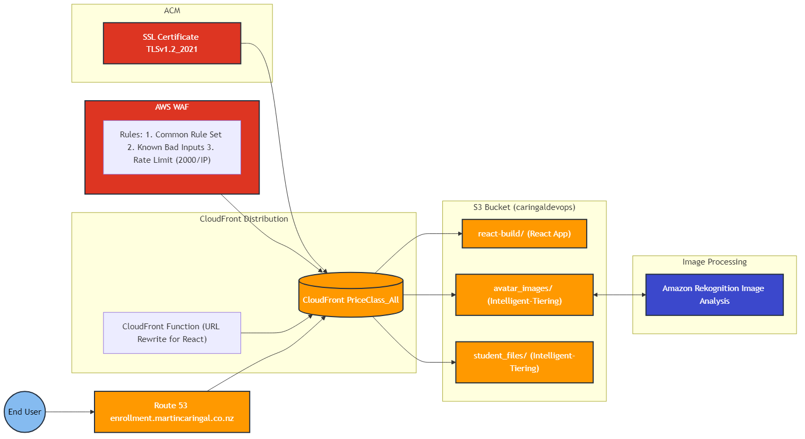

# AWS Infrastructure for Student Record System

This repository contains Terraform configurations for deploying a secure and scalable web infrastructure on AWS, designed to serve a Student Record System built with React.

Repository: [CaringalML/Student-Record-System-React-AWS-Infrastructure](https://github.com/CaringalML/Student-Record-System-React-AWS-Infrastructure)

Related Repositories:

- Frontend Web Application: CaringalML/Student-Record-System-React

## Table of Contents
1. [Architecture Overview](#architecture-overview)
2. [Prerequisites](#prerequisites)
3. [Quick Start](#quick-start)
4. [Component Details](#component-details)
5. [Security Features](#security-features)
6. [Infrastructure Management](#infrastructure-management)
7. [Monitoring and Operations](#monitoring-and-operations)
8. [Troubleshooting](#troubleshooting)
9. [Development](#development)
10. [Support](#support)

## Architecture Overview

The infrastructure consists of:
- CloudFront distribution for content delivery
- S3 bucket for storage with intelligent tiering
- WAF for security
- Route53 for DNS management (martincaringal.co.nz)
- ACM for SSL/TLS certificates

### Infrastructure Diagram



### Key Components
- **CloudFront Distribution**: Serves the React-based Student Record System
- **S3 Bucket**: Stores static files and student-related media content
- **WAF**: Provides web application firewall protection
- **Route53**: Manages DNS records
- **ACM**: Handles SSL/TLS certificates
- **Amazon Rekognition**: Shown in diagram for avatar image validation, but processing is handled by Laravel backend (not part of this infrastructure)

## Prerequisites

- AWS Account
- Terraform ≥ 1.0.0
- AWS CLI configured with appropriate credentials
- Domain registered in Route53 (martincaringal.co.nz)

## Quick Start

1. Clone the repository:
```bash
git clone https://github.com/CaringalML/Student-Record-System-React-AWS-Infrastructure.git
cd Student-Record-System-React-AWS-Infrastructure
```

2. Initialize Terraform:
```bash
terraform init
```

3. Review and modify variables in `variables.tf`:
```hcl
variable "domain_name" {
  description = "Custom domain name"
  default     = "enrollment.martincaringal.co.nz"
}

variable "environment" {
  description = "Environment name"
  default     = "production"
}

variable "aws_region" {
  description = "AWS region"
  default     = "ap-southeast-2"
}
```

4. Deploy the infrastructure:
```bash
terraform plan
terraform apply
```

## Component Details

### CloudFront Distribution

1. **Basic Configuration**
   - IPv6 enabled
   - Price class: All edge locations
   - HTTPS enforcement
   - TLSv1.2_2021 minimum protocol version

2. **Origin Configuration**
   - React App origin (/react-build)
   - Media files origin
   - Origin Access Control (OAC) implementation

3. **CloudFront Function**
```javascript
function handler(event) {
    var request = event.request;
    var uri = request.uri;
    
    // Check whether the URI is missing a file extension
    if (!uri.includes('.')) {
        request.uri = '/index.html';
    }
    
    return request;
}
```

### S3 Bucket Structure

The S3 bucket (`caringaldevops`) is organized with the following structure:

1. `/avatar_images/`
   - Purpose: Stores user avatar images
   - Storage: Immediate transition to Intelligent-Tiering
   - Access: Through CloudFront only
    - Note: While Amazon Rekognition is shown in the infrastructure diagram, image validation 
     is processed by Laravel backend before storing in this directory

2. `/react-build/`
   - Purpose: Contains Student Record System React application build files
   - Access: Served as main application through CloudFront

3. `/student_files/`
   - Purpose: Stores student-related files and documents
   - Storage: Immediate transition to Intelligent-Tiering
   - Access: Through CloudFront only

### WAF Configuration Details

The WAF implementation includes:

1. AWS Managed Rules - Common Rule Set
   - Priority: 1
   - Vendor: AWS
   - Metrics Enabled: Yes

2. AWS Managed Rules - Known Bad Inputs
   - Priority: 2
   - Vendor: AWS
   - Metrics Enabled: Yes

3. Rate Limiting Rule
   - Priority: 3
   - Limit: 2000 requests per IP
   - Action: Block
   - Metrics Enabled: Yes

### S3 Storage Management

1. **Intelligent Tiering Configuration**
```hcl
# Archive tier configuration
tiering {
  access_tier = "ARCHIVE_ACCESS"
  days        = 90
}

# Deep archive tier configuration
tiering {
  access_tier = "DEEP_ARCHIVE_ACCESS"
  days        = 365
}
```

2. **Lifecycle Rules**
   - Avatar Images: Immediate transition to Intelligent-Tiering for student photos
   - Student Files: Immediate transition to Intelligent-Tiering for academic records
   - Cleanup: Abort incomplete multipart uploads after 7 days

3. **Access Control**
   - Public access blocked for student data security
   - CloudFront OAC access only
   - CORS configuration for Student Record System API access

## Security Features

### Access Control
1. **S3 Bucket Security**
```hcl
resource "aws_s3_bucket_public_access_block" "storage_bucket" {
  bucket = aws_s3_bucket.storage_bucket.id
  block_public_acls       = true
  block_public_policy     = true
  ignore_public_acls      = true
  restrict_public_buckets = true
}
```

2. **CloudFront Security**
   - Origin Access Control (OAC) for secure file access
   - HTTPS enforcement for student data protection
   - TLSv1.2_2021 minimum protocol
   - Custom SSL certificate for enrollment.martincaringal.co.nz

3. **WAF Protection**
   - Rate limiting (2000 requests/IP)
   - AWS managed rule sets
   - Custom security rules for student record protection
   - Metrics and logging enabled for audit purposes

## Infrastructure Management

### Resource Organization
```
Student-Record-System-React-AWS-Infrastructure/
├── cloudfront.tf         # CloudFront and function configurations
├── s3.tf                # S3 bucket configurations
├── waf.tf               # WAF configurations
├── dns.tf               # Route53 and SSL configurations
├── iam.tf               # IAM policies
├── lifecycle.tf         # S3 lifecycle rules
├── variables.tf         # Variable definitions
└── README.md           # Documentation
```

### Domain and SSL Management

1. **Route53 Configuration**
```hcl
resource "aws_route53_record" "cloudfront" {
  zone_id = data.aws_route53_zone.main.zone_id
  name    = var.domain_name
  type    = "A"

  alias {
    name                   = aws_cloudfront_distribution.s3_distribution.domain_name
    zone_id                = aws_cloudfront_distribution.s3_distribution.hosted_zone_id
    evaluate_target_health = false
  }
}
```

2. **SSL Certificate**
   - Automatic validation through Route53
   - Auto-renewal enabled for continuous security
   - us-east-1 region requirement for CloudFront compatibility


   ## Monitoring and Operations

### CloudWatch Monitoring

1. **Metrics Available**
   - CloudFront error rates
   - WAF blocked requests
   - S3 bucket operations for student records
   - Origin latency monitoring

2. **Suggested Alarms**
```hcl
resource "aws_cloudwatch_metric_alarm" "error_rate" {
  alarm_name          = "${var.environment}-high-error-rate"
  comparison_operator = "GreaterThanThreshold"
  evaluation_periods  = "2"
  metric_name        = "5xxErrorRate"
  namespace          = "AWS/CloudFront"
  period             = "300"
  statistic          = "Average"
  threshold          = "5"
}
```

### Logging Configuration

1. **WAF Logging**
   - Security event tracking
   - Sampled requests for analysis
   - Metrics enabled for threat detection

2. **CloudFront Logging**
   - Access logs for audit trails
   - Error logs for troubleshooting
   - Cache statistics for performance optimization

## Troubleshooting

### Common Issues and Solutions

1. **CloudFront 403 Errors**
   - Check S3 bucket policy configuration:
   ```hcl
   {
     "Version": "2012-10-17",
     "Statement": [{
       "Sid": "AllowCloudFrontServicePrincipal",
       "Effect": "Allow",
       "Principal": {
         "Service": "cloudfront.amazonaws.com"
       },
       "Action": [
         "s3:GetObject",
         "s3:PutObject",
         "s3:DeleteObject",
         "s3:ListBucket"
       ],
       "Resource": [
         "arn:aws:s3:::caringaldevops/*",
         "arn:aws:s3:::caringaldevops"
       ],
       "Condition": {
         "StringEquals": {
           "AWS:SourceArn": "[DISTRIBUTION_ARN]"
         }
       }
     }]
   }
   ```
   - Verify OAC configuration for student file access
   - Check WAF rules for false positives
   - Validate function associations for React routing

2. **SSL Certificate Issues**
   - Verify ACM certificate region (must be us-east-1)
   - Check DNS validation records
   - Confirm domain ownership
   - Review certificate renewal status

## Development

### Local Development Setup

1. **Environment Setup**
```bash
# Install required tools
brew install terraform awscli

# Configure AWS credentials
aws configure

# Clone repository
git clone https://github.com/CaringalML/Student-Record-System-React-AWS-Infrastructure.git
cd Student-Record-System-React-AWS-Infrastructure
```

2. **Development Best Practices**
   - Use terraform workspaces for different environments
   - Keep sensitive variables in terraform.tfvars
   - Use consistent naming conventions
   - Document all changes

### Testing and Validation

1. **Infrastructure Testing**
```bash
# Validate Terraform configurations
terraform validate

# Check formatting
terraform fmt

# Run security scan
checkov -d .

# Plan changes
terraform plan
```

2. **Application Deployment Testing**
```bash
# Build React application
npm run build

# Test S3 upload
aws s3 sync build/ s3://caringaldevops/react-build/ --dryrun

# Verify CloudFront distribution
curl -I https://enrollment.martincaringal.co.nz
```

## Support and Maintenance

### Regular Maintenance

1. **Daily Tasks**
   - Monitor WAF blocks and security events
   - Check student record access patterns
   - Verify backup completion

2. **Weekly Tasks**
   - Review security updates
   - Optimize cost for storage and distribution
   - Analyze performance metrics

3. **Monthly Tasks**
   - Security assessment
   - Resource optimization review
   - Compliance verification

### Contact Information

For support and assistance:
- Technical Issues: lawrencecaringal5@gmail.com
- Infrastructure Support: [GitHub Issues](https://github.com/CaringalML/Student-Record-System-React-AWS-Infrastructure/issues)

## Variable Reference

| Name | Description | Type | Default | Required |
|------|-------------|------|---------|:--------:|
| aws_region | AWS Region | string | ap-southeast-2 | no |
| environment | Environment name | string | production | no |
| domain_name | Custom domain name | string | enrollment.martincaringal.co.nz | no |
| s3_bucket_name | S3 bucket name | string | caringaldevops | no |

## Tags

Primary tags used across resources:
```hcl
tags = {
  Environment = var.environment
  Project     = "Student-Record-System"
  Owner       = "Martin Caringal"
  ManagedBy   = "Terraform"
}
```

## License

This project is licensed under the MIT License - see the LICENSE file for details.
